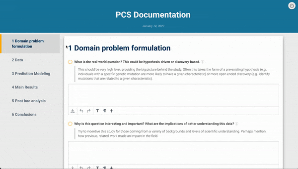

# Welcome to vdocs!

<!-- badges: start -->
<!-- badges: end -->

`vdocs` creates beautiful, rigorous, and transparent data analysis reports via "PCS lab notebooks" like the one below!



## Overview

In the modern era of "Big Data", providing a rigorous and transparent narrative and justification for decisions made throughout data analysis pipelines is becoming increasingly important for scientific reproducibility. For example, what models were tried and why? How was the data cleaned and why? What are the results, and what do they mean with respect to the real world? The goal of `vdocs` is to provide a beautiful Rmarkdown theme and user-friendly template to facilitate documentation of PCS-style analyses for veridical data science [(Kumbier and Yu, 2020)](https://www.pnas.org/content/117/8/3920). Like scientists with their lab notebooks, data scientists should provide a narrative of their discoveries and justification for human judgment calls made along the way in a lab notebook designed for veridical data science. `vdocs` makes this documentation via a "PCS lab notebook" quick and easy with the click of a button and minimal code!

## Installation

`vdocs` is under active development. To install the package directly from GitHub, please use:

``` r
devtools::install_github("Yu-Group/vdocs")
```

## Creating a PCS Lab Notebook

After installing `vdocs`, the `veridical` Rmarkdown theme and the accompanying "PCS Lab Notebook" template are now available for use. In RStudio, the easiest way to start a new PCS Lab Notebook is to open a new Rmarkdown file from template: go to `File > New File > R Markdown... > From Template > PCS Lab Notebook` and voila! Type in the title of your analysis, authors, input parameters, and click `knit` to generate the automated report. (Note that you can click the `Knit with Parameters...` in the `knit` dropdown menu for easy input of the analysis parameters.) 

The provided lab notebook template has been auto-populated with code to perform a standard PCS-style analysis with basic prediction and stability checks, but of course, you can change any R code that you would like to meet your needs. The PCS lab notebook still adds much-needed value by providing a checklist of questions that every data scientist should consider and document throughout the analysis pipeline. While responding to these questions takes time, we highly encourage every data scientist or practitioner to put in this extra effort as a step towards our greater goal of ensuring scientific reproducibility!


