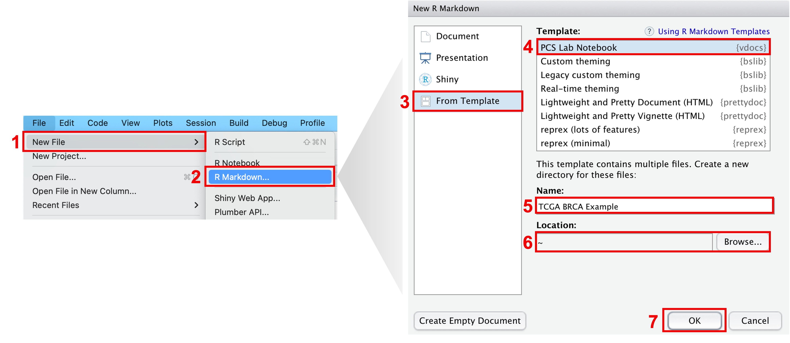
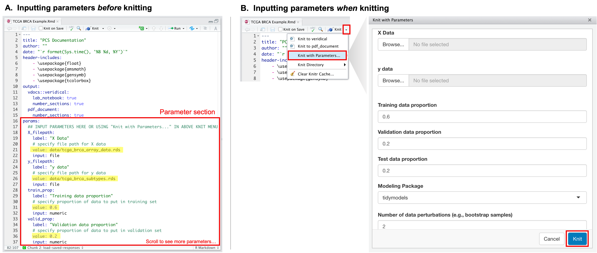
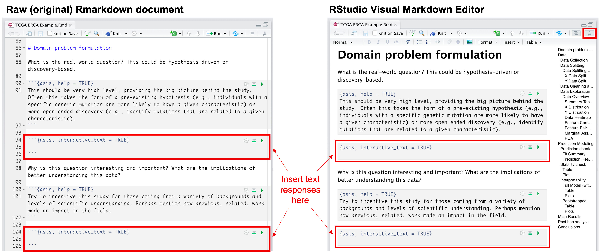
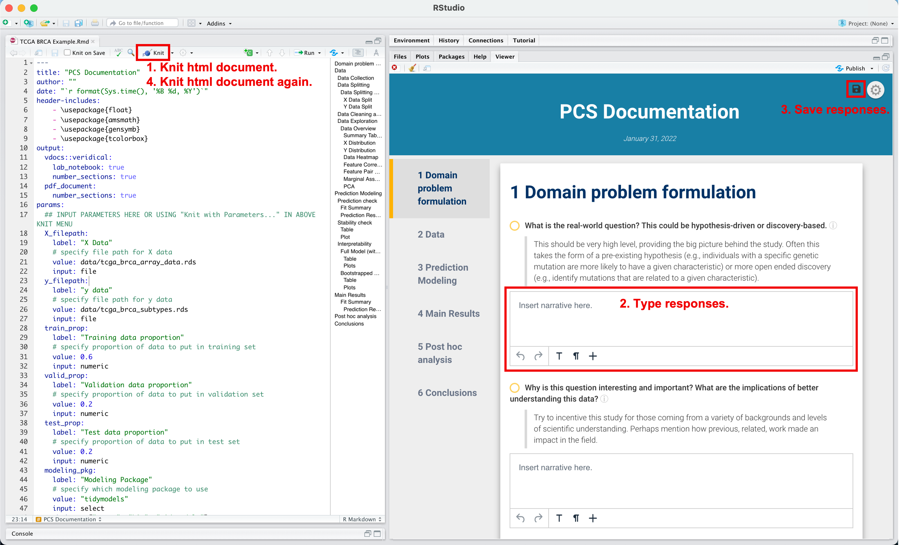

```{r, include = FALSE}
knitr::opts_chunk$set(
  collapse = TRUE,
  comment = "#>"
)
```

```{r setup}
library(vdocs)
```

# Overview

`vdocs` creates beautiful, rigorous, and transparent data analysis reports via "PCS lab notebooks" like the one below!

<p align="center">
  
</p>

With a "PCS lab notebook", practitioners can provide a complete narrative of their data analysis and easily document any human judgment calls made along the way to promote trustworthy and veridical data science. For more on veridical data science, see [Kumbier and Yu (2020)](https://www.pnas.org/content/117/8/3920). In addition to the convenient documentation template, `vdocs` provides starter code to run a PCS-style analysis with basic prediction and stability checks. 

# Create a New PCS Lab Notebook

To get started, the easiest way to create a new PCS Lab Notebook is to open a new Rmarkdown file from template in RStudio: go to `File > New File > R Markdown... > From Template > PCS Lab Notebook > OK` and voila! A directory, whose name was specified in the `Name` dialog box, has been created and contains the .Rmd PCS lab notebook template.

<center>

{width=100%}

</center>

This lab notebook template has been auto-populated with code to perform a standard PCS-style analysis, but of course, any or all of the R code can be changed. The PCS lab notebook still adds much-needed value by providing a checklist of questions that every data scientist should consider and document throughout the analysis pipeline. While responding to these questions takes time, we highly encourage every data scientist or practitioner to put in this extra effort as a step towards our greater goal of ensuring scientific reproducibility!

# Example Usage: TCGA BRCA Data

Let us now walk through an example usage of the PCS lab notebook using breast cancer (BRCA) data from [The Cancer Genome Atlas](https://www.cancer.gov/about-nci/organization/ccg/research/structural-genomics/tcga) (TCGA). For the sake of this walkthrough, the question of interest is two-fold: (1) whether we can predict the breast cancer subtype (known as the PAM50 subtype) using gene expression data and (2) which genes lead to these predictions. There are five different subtypes (Luminal A, Luminal B, HER2-enriched, Basal-like, and Normal-like) in this classification problem. More information on these PAM50 cancer subtypes can be found in [The Cancer Genome Atlas Network (2012)](https://www.nature.com/articles/nature11412).

## Step 1: Download Data

To begin, we must first obtain the data of interest. Here, we will make use of the `TCGAbiolinks` package, which can be installed through `Bioconductor`. In the following code snippet to be run in the R console, we download gene expression data, measured via RNA-Seq, for TCGA breast cancer patients along with their PAM50 breast cancer subtype classification. 

```{r eval = FALSE}
# Set query for TCGA BRCA gene expression data, measured via RNA-Seq
query <- TCGAbiolinks::GDCquery(
  project = "TCGA-BRCA",
  data.category = "Gene expression",
  data.type = "Gene expression quantification",
  platform = "Illumina HiSeq",
  file.type  = "normalized_results",
  experimental.strategy = "RNA-Seq",
  legacy = TRUE
)

# Download and prepare data requested in query
TCGAbiolinks::GDCdownload(query)
data <- TCGAbiolinks::GDCprepare(query)

# Convert clinical data and assay data into data.frames
y_data <- data.frame(SummarizedExperiment::colData(data))
X_data <- data.frame(t(SummarizedExperiment::assay(data)))

# Remove samples that do not have a corresponding PAM50 subtype
keep_samples <- !is.na(y_data$paper_BRCA_Subtype_PAM50)
y <- as.factor(y_data$paper_BRCA_Subtype_PAM50[keep_samples])
X <- X_data[keep_samples, ]

# Save assay data (X) and PAM50 subtype data (y) to disk
if (!dir.exists(file.path("TCGA BRCA Example", "data"))) {
  dir.create(file.path("TCGA BRCA Example", "data"), recursive = TRUE)
}
saveRDS(y, "TCGA BRCA Example/data/tcga_brca_subtypes.rds")
saveRDS(X, "TCGA BRCA Example/data/tcga_brca_array_data.rds")

```

As a result, the following have been saved to disk:

- `X`: a data frame of gene expression values, measured via RNA-Seq, where each row corresponds to a patient and each column corresponds to a gene.
- `y`: a response vector with the PAM50 breast cancer subtypes.

## Step 2: Input Rmarkdown Parameters

After obtaining the data and saving it to disk, we can next input the required parameters to run the PCS lab notebook. We provide a brief description of the parameters below.

- **X Data**: A single character string, specifying the file path corresponding to the design/covariate matrix `X`. Note that this file path should be relative to the location of the Rmarkdown file.
- **y Data**: A single character string, specifying the file path corresponding to the response vector `y`. Note that this file path should be relative to the location of the Rmarkdown file.
- **Training data proportion**: A numeric value between 0 and 1, indicating the proportion of data to use in the training set.
- **Validation data proportion**: A numeric value between 0 and 1, indicating the proportion of data to use in the validation set.
- **Test data proportion**: A numeric value between 0 and 1, indicating the proportion of data to use in the test set. Note that the training, validation, and test data proportions should sum to 1.
- **Modeling Package**: One of "caret", "h2o", or "tidymodels", indicating the modeling package to use as backend in the analysis.
- **Number of data perturbations**: An integer greater than 0, specifying the number of data perturbations to include in the PCS pipeline. A larger number of data perturbations provides a better measure of stability and trust, but at the cost of a higher computational load.
- **Random Seed**: An integer to set the random seed.

These parameters can be set in one of two ways:

A.  In the parameter section of the PCS lab notebook (i.e., the `params:` section within the yaml header of the Rmarkdown), input the desired values in the `value:` slot for each parameter.
B.  Alternatively, when it is time to knit the document, click on the knit dropdown menu, and click `Knit with parameters`. A pop-up box will show up with slots to fill out for each parameter.

<center>

{width=100%}

</center>

## Step 3: Modify Code

After inputting the necessary parameters, users can modify any of the template code to meet one's needs. The template code can be easily identified as they are found within R code chunks (i.e., code chunks that begin with ````{r ...}`). While any of the R code chunks can be modified, some code chunks that frequently require modification are those labeled:

- **preprocess-data**: This code chunk should contain code to clean and preprocess the `X` and/or `y` data.
- **caret-fit-params**: This code chunk should contain input arguments that specify the methods and training controls used in the call to `caret`. This code chunk is only run when the modeling package is set to be "caret" in step 2.
- **h2o-fit-params**: This code chunk should contain input arguments that specify the methods and training controls used in the call to `h2o`. This code chunk is only run when the modeling package is set to be "h2o" in step 2.
- **tidymodels-fit-params**: This code chunk should contain input arguments that specify the methods and training controls used in the call to `tidymodels`. This code chunk is only run when the modeling package is set to be "tidymodels" in step 2.

For this example analysis, we choose to do some data cleaning and reduce the number of features in the `X` matrix. Originally, the `X` data consisted of ~20,000 genes, but to reduce the computational burden of this example, we choose to keep only the top 1000 genes, ranked by highest variance. We also choose to remove constant or duplicated columns from the data. To accomplish this, we insert the following code snippet into the code chunk labeled `preprocess-data`.

```{r preprocess-data, eval = FALSE}
Xtrain <- log(Xtrain + 1) %>%
  removeConstantCols(verbose = 1) %>%
  removeDuplicateCols(verbose = 1) %>%
  filterColsByVar(max_p = 1000)
Xvalid <- log(Xvalid + 1)[, colnames(Xtrain)]
Xtest <- log(Xtest + 1)[, colnames(Xtrain)]
```

As for the modeling section, the PCS lab notebook, by default, provides code to run both a random forest and xgboost fit. We will use these default models for this example. However, these models can be replaced, removed, or added onto. Please see the help page for `fitModels` (`? vdocs::fitModels`) for more information on how to specify these models, their parameters, and other training options.

## Step 4: Provide a Narrative

The final and by far the most important step is to provide a transparent narrative for the entire analysis. One of the key assets of the PCS lab notebook is that this narrative is made simple through a guided checklist of questions that every practitioner should consider and document throughout the analysis pipeline. These questions can be answered in one of two ways:

A.  They can be answered by directly typing responses into the Rmarkdown code chunks that are labeled ````{asis, interactive_text = TRUE}` before knitting. (Check out the [Visual R Markdown](https://rstudio.github.io/visual-markdown-editing/) editor that was rolled out in RStudio v1.4! This visual markdown editing mode is great for those who are less familiar with Rmarkdown.)

<center>

{width=100%}

</center>

B.  Alternatively, practitioners can type in their responses to the guided questions after knitting to html. After knitting, the questions that require responses will be followed by interactive textboxes. **To save these responses, click on the "save" button, located in the top right corner of the knitted html document, and save the responses zip file in the same directory as the Rmarkdown file. Then, re-knit the Rmarkdown file to see the saved responses.**

<center>

{width=100%}

</center>

Note: though we list this step as last for organization and clarity, we encourage practitioners to provide this narrative concurrently with any code modifications (in step 3). 

## The End Product

After answering the guided questions and knitting the Rmarkdown, we get a beautiful html report like the TCGA BRCA report [here](TCGA-BRCA-Example.html), generated from the Rmarkdown file [here](https://github.com/Yu-Group/vdocs/blob/main/vignettes/TCGA BRCA Example/TCGA BRCA Example.Rmd). If a pdf is preferred over html, one can click `Knit to pdf_document` in the knit dropdown menu.

# Stay Tuned!

More to come including 

- example responses to the guided questions for the TCGA BRCA data
- a more detailed walkthrough of each section in the PCS lab notebook template
- a shiny version for less experienced R users

